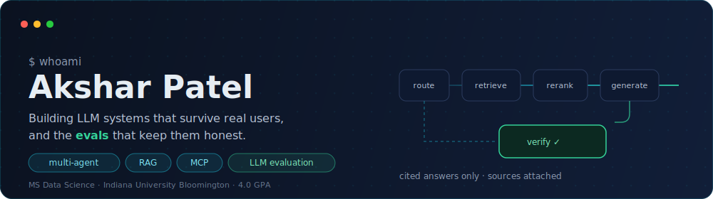
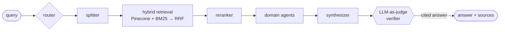

  

  
  
  

MS Data Science @ **Indiana University Bloomington** (4.0 GPA, May 2027). Currently: **AI Engineering Intern @ Hitachi Global Air Power** and **ML Engineer (part-time) @ Indiana University**. I build multi-agent and RAG systems for real users, then build the evaluation suites that tell me whether to trust them.

  
  
  
  
  
  
  
  
  
  
  
  
  
  

## 🚀 Flagship systems

<table>
<tr>
<td width="50%" valign="top">

### 🎓 [EduPilot](https://github.com/Akshar106/EduPilot-A-Multi-Agent-Source-Grounded-Educational-AI-System-for-Adaptive-and-Cross-Domain-Learning)

**Multi-agent, source-grounded RAG** for graduate coursework. 7-stage pipeline with hybrid retrieval (Pinecone + BM25, fused via Reciprocal Rank Fusion) and LLM-as-judge verification. Every answer cites the exact lecture and page.

`FastAPI` `Pinecone` `BM25 + RRF` `Groq Llama 3.3 70B`

📊 **50-case, 8-metric eval suite** — faithfulness, citation accuracy, adversarial hallucination tests
⚡ **Finding: a 3.7x citation-accuracy gap** between 70B and 8B models on identical inputs

Built with [Khushi Shah](https://github.com/shahkhushi28k)

</td>
<td width="50%" valign="top">

### 🏥 [IntelliSphere](https://github.com/Akshar106/IntelliSphere-Domain-Specific-RAG-Conversational-AI-)

**Domain-specific RAG, deployed for real.** Healthcare + legal document QA with MongoDB-backed multi-session conversation memory and metadata-tagged FAISS retrieval.

`Flask` `LangChain` `FAISS` `Gemini` `MongoDB`

🚢 **Full CI/CD**: Docker → GitHub Actions → Amazon ECR → auto-deploy to EC2 (self-hosted runner)
☁️ FAISS indexes synced from **S3** at container startup, served by gunicorn

</td>
</tr>
</table>

### How EduPilot thinks

## 🔒 Shipped behind private walls

The work I can't open-source, with the receipts I can share:

| System | Stack | Receipt |
|---|---|---|
| Query router for IU's **One.IU** portal | embeddings + fuzzy + LLM tiebreaker | **98.6% accuracy** across a closed catalog of 33 applications |
| Live-data tool API for IU's **ChatAIU** assistant | Azure App Service, REST | **Adopted by the ChatAIU team** as an agent tool |
| **LLM autograding** platform on Canvas LMS | Flask, OAuth2, schema-validated outputs | Every grade passes a **faculty review-and-override queue** |
| Enterprise **multi-agent assistant** @ Hitachi | Copilot Studio, MCP, Snowflake Cortex | **60 users across 5 departments** on Teams |

<b>🔬 The 3.7x finding, in 60 seconds</b>

 

Same pipeline. Same prompts. Same retrieved context. The only variable: the generator model.

- **Llama 3.3 70B** — citation accuracy **1.00**
- **Llama 3.1 8B** — citation accuracy **0.27**

Measured across a shared query set inside a 50-case, 8-metric evaluation suite (faithfulness, citation accuracy, retrieval hit rate, quality, coverage, latency, intent and domain accuracy). The takeaway that changed how I build: **model choice alone decided whether citations could be trusted** — retrieval quality couldn't compensate. This is why every system I ship now includes an eval suite before it includes a feature roadmap.

> I try to know the denominator behind every number I claim.

---

  <a href="mailto:patelakshar1104@gmail.com">📫 patelakshar1104@gmail.com</a> · <a href="https://www.linkedin.com/in/akshar-patel11/">💼 LinkedIn</a> · Open to full-time AI/ML/Data Science roles starting 2027

